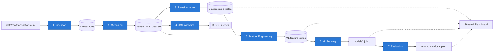

# AI-Powered E-Commerce Analytics Platform


[](https://github.com/Chittalasailu/AI-Powered-Data-Analytics-Platform/actions/workflows/ci.yml)


A PySpark and Delta Lake data platform that takes raw e-commerce
transactions through ingestion, cleansing, SQL analytics, feature
engineering, and two trained ML models (customer segmentation, churn
prediction), then serves the results through a Streamlit dashboard. It
runs identically as a local CLI pipeline or a native Databricks notebook,
both driven by one `config.yaml`, with an automated pytest suite and
GitHub Actions CI validating every push.

This repo is written to be read, not just run: every non-obvious decision
(a broadcast join, a repartition, a temporal train/test split for a churn
model) is explained in-line with *why*, not just *what*, and the trickier
ones are backed by real captured Spark `EXPLAIN` plans rather than
assertions — see [Engineering Decisions](#engineering-decisions).

## Table of Contents

- [Key Features](#key-features)
- [Architecture](#architecture)
- [Tech Stack](#tech-stack)
- [Project Structure](#project-structure)
- [Data Pipeline](#data-pipeline)
- [Machine Learning](#machine-learning)
- [Dashboard](#dashboard)
- [Setup](#setup)
- [Running the Pipeline](#running-the-pipeline)
- [Running the Dashboard](#running-the-dashboard)
- [Testing](#testing)
- [Sample Results](#sample-results)
- [Engineering Decisions](#engineering-decisions)
- [CI/CD](#cicd)
- [Databricks](#databricks)
- [Limitations](#limitations)
- [Future Improvements](#future-improvements)
- [Contributing](#contributing)
- [License](#license)

## Key Features

- Explicit schema validation on ingestion, with `PERMISSIVE`-mode parsing so malformed rows are captured and counted, not silently dropped
- Data cleansing: deduplication, date standardization, type/range enforcement, IQR outlier capping, per-column null imputation
- Delta Lake storage for every processed table at every pipeline stage
- Spark SQL analytics catalog — 11 named queries (revenue trends, customer LTV, cohort retention, regional performance)
- RFM customer analytics computed in Spark
- Customer segmentation via KMeans, with silhouette-driven automatic `k` selection
- Churn prediction via RandomForest, with a **temporal** (leakage-safe) train/label split
- Feature engineering including a Shannon-entropy category-diversity metric
- Model evaluation: silhouette + cluster profiling; precision/recall/F1/ROC-AUC + confusion matrix
- Interactive Streamlit dashboard — 4 tabs, sidebar filters, all reading live from Delta and persisted models
- Native Databricks notebook pipeline (architecturally distinct from the CLI, not a port of it)
- Automated test suite (pytest) with a shared local `SparkSession` fixture
- GitHub Actions CI — syntax-checks every entry point and runs the full test suite on every push/PR
- Spark performance work verified with real captured `EXPLAIN` plans, not assumptions

## Architecture



**Two execution paths, same seven stages:**

| | Local / CLI | Databricks |
|---|---|---|
| Entry point | `src/pipeline.py` | `notebooks/databricks_pipeline.py` |
| Spark session | One new `SparkSession` per stage (subprocess) | One shared cluster session for the whole run |
| Parameters | `argparse` (`--stage`, `--config`, `--env`) | `dbutils.widgets` |
| Scheduling | cron / manual / CI | Databricks Jobs (documented in the notebook) |

`dashboards/app.py` is a third, independent path: it reads the processed
Delta tables and persisted `.joblib` models straight off disk (via
`deltalake`, no Spark/JVM needed) and never re-derives anything the
pipeline already computed.

## Tech Stack

| Category | Technology |
|---|---|
| **Data Processing** | PySpark 4.2, Spark SQL |
| **Storage** | Delta Lake (`delta-spark` 4.4 locally, native Delta on Databricks) |
| **Analytics** | Spark SQL (11-query catalog), RFM analysis |
| **Machine Learning** | scikit-learn (KMeans, RandomForestClassifier), joblib |
| **Dashboard** | Streamlit, Plotly, `deltalake` (delta-rs — pure-Python Delta reads) |
| **Testing** | pytest, session-scoped local `SparkSession` fixture |
| **Platform** | Databricks (Repos, Jobs, notebooks) |
| **CI/CD** | GitHub Actions |
| Data wrangling | pandas, PyYAML |

## Project Structure

Generated from the actual repository:

```
AI-Powered-Data-Analytics-Platform/
├── config/
│   └── config.yaml                  # single source of truth: paths, formats, model params
├── data/
│   ├── raw/                         # transactions.csv (synthetic, generated — see generate_sample_data.py)
│   └── processed/                   # Delta tables written by every pipeline stage (gitignored, pipeline-generated)
├── docs/
│   └── screenshots/                 # dashboard screenshots (captured from a live local run)
├── src/
│   ├── ingestion/ingest.py           # CSV -> Delta, explicit schema, PERMISSIVE-mode validation
│   ├── transformation/
│   │   ├── cleanse.py                # dedup, date standardization, IQR outliers, null imputation
│   │   ├── transform.py              # 5 aggregated analytics tables + Spark optimizations
│   │   └── sql_runner.py             # runs sql/analytics_queries.sql; generates the optimization notes
│   ├── ml/
│   │   ├── feature_engineering.py    # clustering features + leakage-safe churn features
│   │   ├── train_model.py            # KMeans segmentation + RandomForest churn classifier
│   │   └── evaluate.py               # silhouette / precision / recall / F1 / ROC-AUC + confusion matrix
│   ├── utils/                        # shared config loading, Spark session, logging, sample-data generator
│   └── pipeline.py                   # CLI orchestrator: `python src/pipeline.py --stage all`
├── sql/
│   ├── analytics_queries.sql         # 11 named queries: revenue trends, LTV, cohorts, regional
│   └── query_optimization_notes.md   # 3 unoptimized/optimized pairs with real EXPLAIN plans
├── notebooks/databricks_pipeline.py  # Databricks-native mirror of the full pipeline
├── dashboards/app.py                 # Streamlit dashboard (4 tabs, sidebar filters)
├── models/                           # persisted joblib models (gitignored, pipeline-generated)
├── reports/                          # evaluation metrics + confusion matrix plot (gitignored, generated)
├── tests/                            # pytest suite + shared SparkSession fixture + mock-data factories
├── .github/workflows/ci.yml          # GitHub Actions: syntax-check + pytest on every push/PR
├── LICENSE                           # MIT
├── pytest.ini
├── requirements.txt
└── CONTRIBUTING.md
```

## Data Pipeline

Each stage is independently runnable
(`python src/<stage script> --config config/config.yaml`) and is also
wired into `src/pipeline.py`.

| # | Stage | What it does | Why |
|---|---|---|---|
| 1 | **Ingestion** | Reads the raw CSV against an explicit `StructType` schema in `PERMISSIVE` mode, validates it, writes to Delta. | Malformed rows are captured in `_corrupt_record` and counted rather than silently dropped — the boundary between "data someone handed us" and "data we're willing to build a report or model on." |
| 2 | **Cleansing** | Deduplication, date standardization, type/range enforcement, IQR outlier capping, per-column null imputation. | Every step preserves row count except deduplication — outliers and invalid values are treated (capped/nulled), never silently dropped. |
| 3 | **Transformation** | Builds 5 aggregated Delta tables: daily/monthly revenue by region and category, customer RFM, top products, payment-method distribution. | The analytics-ready layer the dashboard and BI queries actually read — see [Engineering Decisions](#engineering-decisions) for the Spark optimizations here. |
| 4 | **SQL Analytics** | Runs the 11-query catalog in `sql/analytics_queries.sql` against the cleansed data. | The analytics layer as plain Spark SQL; also the source of the documented query-optimization comparisons. |
| 5 | **Feature Engineering** | Builds two separate feature tables: full-history features for clustering, leakage-safe (temporal-cutoff) features for churn. | The two downstream models need different definitions of "safe" features — see [Machine Learning](#machine-learning). |
| 6 | **Model Training** | Trains a KMeans segmentation model and a RandomForest churn classifier, each as one `sklearn.Pipeline`, persisted via `joblib`. | One artifact per model with preprocessing bundled in — no separate scaler/encoder to keep in sync at inference time. |
| 7 | **Evaluation** | Computes silhouette + cluster profile for segmentation; precision/recall/F1/ROC-AUC + confusion matrix for churn. Writes to `reports/`. | The metrics a stakeholder (or the dashboard) needs to trust the model — see [Sample Results](#sample-results). |

## Machine Learning

### Customer Segmentation — KMeans

- **Features**: recency, frequency, monetary, avg order value, distinct categories, category-diversity entropy, distinct payment methods, tenure, customer age.
- **Automatic `k` selection**: sweeps k=3–8, picks the value with the best silhouette score — not a hardcoded guess.
- **Evaluation**: silhouette score plus a per-cluster feature-mean profile (a silhouette number alone doesn't say *who* is in cluster 2).
- **Persistence**: one `sklearn.Pipeline` (scaler + KMeans), saved as a single `joblib` file.

### Churn Prediction — Random Forest

- **Temporal train/label split, not a random split**: features are computed only from transactions before a cutoff date; the label (`churned`) comes from activity strictly after it. This deliberately avoids reusing the full-history RFM's `recency_days` as a feature, since that column is measured against the dataset's true final date — exactly what the label is trying to predict.
- **Class balancing**: `class_weight="balanced"`, guarding against the "just predict the majority class" failure mode.
- **Evaluation**: held-out stratified test split, precision/recall/F1 (per class + macro), ROC-AUC.
- **Persistence**: one `sklearn.Pipeline` (preprocessing + RandomForestClassifier), saved as a single `joblib` file.

**Current churn performance, stated plainly:** ROC-AUC ≈ **0.5038** on this
dataset — essentially random (see [Sample Results](#sample-results) for
the full numbers). This is a property of the synthetic dataset, not a
flaw in the modeling approach: `src/utils/generate_sample_data.py`
generates each transaction's date independently, so there's no genuine
persistent per-customer behavioral signal for a temporally-honest model to
find. A near-0.5 AUC here is *evidence the leakage prevention is working*
— a leaky pipeline would show suspiciously good performance instead of
none. The same architecture, run against data with real customer-level
behavioral persistence, would be expected to show real lift.

## Dashboard

`dashboards/app.py` — a Streamlit app reading directly from the processed
Delta tables and persisted models, with sidebar filters (date range,
region, category) that scope every tab consistently.

### Revenue Trends
Line chart (daily/weekly/monthly granularity), one line per region, KPI
row, and a "view as table" expander.


### Customer Segments
Cluster-size bar chart and an axis-selectable scatter plot, colored and
shaped by cluster — predicted live from the persisted KMeans model — plus
an optional 2D PCA projection and a live-computed cluster profile table.


### Top Products & Categories
Toggle between product- and category-level granularity, a horizontal bar
chart, and the backing data table.


### Churn Prediction
KPI row, a predicted-churn-probability histogram split by actual outcome
— predicted live from the persisted RandomForest model — a
threshold-filterable at-risk customer table, and the confusion matrix
from the last evaluation run.


*Screenshots above were captured from a live local run of this exact
dashboard against the sample dataset.*

## Setup

### Windows

```powershell
python -m venv venv
.\venv\Scripts\Activate.ps1
pip install -r requirements.txt
```

Spark needs `winutils.exe` even for a purely local `local[*]` session —
this is a Spark-on-Windows requirement, not specific to this project. Get
a build matching your Hadoop version (e.g. from `cdarlint/winutils` on
GitHub), place it at `<HADOOP_HOME>\bin\winutils.exe`, then:

```powershell
$env:HADOOP_HOME = "C:\hadoop"
$env:PATH = "C:\hadoop\bin;$env:PATH"
$env:PYSPARK_PYTHON = "$PWD\venv\Scripts\python.exe"
$env:PYSPARK_DRIVER_PYTHON = "$PWD\venv\Scripts\python.exe"
```

### Linux / macOS

```bash
python3 -m venv venv
source venv/bin/activate
pip install -r requirements.txt
```

No `winutils.exe`/`HADOOP_HOME` needed — that's Windows-only. A JVM
(Java 17+) still needs to be installed for PySpark.

### Both platforms

```bash
python src/utils/generate_sample_data.py --rows 50000 --seed 42   # if data/raw/transactions.csv isn't already present
```

`config/config.yaml` defaults to `environment: local`, reading/writing
`data/` relative to the repo root — nothing else needs changing to run
locally. For Databricks, see [Databricks](#databricks).

## Running the Pipeline

```bash
python src/pipeline.py --stage all          # everything, in order
python src/pipeline.py --stage ingest       # one stage
python src/pipeline.py --stage cleanse transform   # a subset (always run in pipeline order)
```

Flags:

```bash
python src/pipeline.py --stage all --dry-run              # print the plan, run nothing
python src/pipeline.py --stage all --continue-on-failure   # don't stop at the first failed stage
python src/pipeline.py --stage all --env databricks        # forwarded to every stage's own --env
```

Each stage is also independently runnable (what `pipeline.py` calls under
the hood):

```bash
python src/ingestion/ingest.py --config config/config.yaml
python src/transformation/sql_runner.py --list                                 # list the query catalog
python src/transformation/sql_runner.py --query customer_ltv_ranking           # run one query
python src/transformation/sql_runner.py --compare-optimizations --write-notes  # regenerate sql/query_optimization_notes.md
```

## Running the Dashboard

Requires the pipeline to have populated `data/processed/` and `models/`
first (at minimum: `ingest cleanse transform feature_engineering
train_model`).

```bash
streamlit run dashboards/app.py
```

Opens at `http://localhost:8501`. This is a local-only `streamlit run` —
there is no cloud deployment of this dashboard.

## Testing

```bash
pytest
```

`tests/conftest.py` provides a single session-scoped local `SparkSession`
fixture shared by every test (a SparkSession is expensive to start, so
it's built once, not per test). `tests/factories.py` builds
schema-correct mock DataFrames without repeating all 12 transaction
columns in every test.

| File | Covers |
|---|---|
| `tests/test_ingestion.py` | Schema validation — exact match, missing column, type mismatch, tolerated extra columns |
| `tests/test_cleansing.py` | Deduplication (exact + conflicting-ID), IQR outlier capping, valid-range enforcement, null imputation, and the full `DataCleanser` pipeline |
| `tests/test_transformation.py` | `compute_daily_revenue`, `compute_customer_rfm`, `compute_top_products_by_category` |
| `tests/test_feature_engineering.py` | Output shape/columns and row-level correctness for both `build_clustering_features` and `build_churn_features`, including the churn label's temporal-cutoff logic |

Windows: the same `HADOOP_HOME`/`winutils.exe` setup from [Setup](#setup)
is required — see also [Limitations](#limitations).

## Sample Results

Real output from an actual full pipeline run against the 50K-row
**synthetic sample dataset** (`python src/pipeline.py --stage all`) —
regenerate these yourself; nothing below is hardcoded in the repo, and
none of it should be read as a production benchmark.

**Pipeline run — all 7 stages, real timing:**

```
[  OK   ] ingest                    78.53s
[  OK   ] cleanse                  195.76s
[  OK   ] transform                105.59s
[  OK   ] sql_analytics             80.28s
[  OK   ] feature_engineering      145.95s
[  OK   ] train_model              201.19s
[  OK   ] evaluate                 128.66s
Total elapsed: 935.98s
```

**Segmentation** (`reports/segmentation_metrics.json`):

| Metric | Value |
|---|---|
| Silhouette score | 0.1884 |
| Clusters (k) | 3 |
| Customers | 5,996 |
| Cluster sizes | 2,258 / 2,729 / 1,009 |

**Churn** (`reports/churn_metrics.json`) — see
[Machine Learning](#machine-learning) for why this AUC is deliberately,
informatively close to 0.5:

| Metric | Value |
|---|---|
| Accuracy | 0.5063 |
| ROC-AUC | 0.5038 |
| Precision (churned) | 0.4706 |
| Recall (churned) | 0.4421 |
| F1 (churned) | 0.4559 |

## Engineering Decisions

Each entry: the problem, the decision made, why, and the evidence it
actually worked — not a generic textbook explanation.

### Spark Performance (`src/transformation/transform.py`)

**Broadcast joins.** *Problem:* joining a 5-row region dimension (and
per-category/grand-total aggregates) onto the full fact table via a
default sort-merge join shuffles the entire fact table just to attach a
lookup value. *Decision:* explicit `F.broadcast()` hints. *Result:*
verified via `EXPLAIN FORMATTED` that Spark's physical plan actually uses
`BroadcastHashJoin`, not assumed — see `sql/query_optimization_notes.md`.

**Repartition for shuffle elimination.** *Problem:* the RFM
`groupBy("customer_id")` would shuffle the whole dataset again even
though it was already shuffled once upstream. *Decision:*
`repartition(n, "customer_id")` on the base dataset, matching the
aggregation's required partitioning. *Result:* Spark's planner elides the
redundant `Exchange` since the child's partitioning already satisfies it.

**Caching with a stated reason.** *Problem:* 5 independent output tables
each scan the same base dataset; the per-customer RFM aggregate is read
by 3 `approxQuantile` calls plus the final scoring pass. *Decision:*
cache both, explicitly, at the point they're reused — not cached
"by default." *Result:* each shared DataFrame is computed once, not once
per consumer.

**Narrow over wide.** *Problem:* RFM's recency/frequency/monetary could
be computed as three separate groupBys joined back together, and quartile
scoring could use `ntile()` over an unpartitioned `Window`. *Decision:*
one `groupBy().agg()` for all three RFM metrics; `approxQuantile` +
`when/otherwise` for scoring instead of a global window. *Result:* avoids
both the extra shuffles from three groupBys and the single-partition
collapse an unpartitioned window would force.

**`coalesce()` vs `repartition()`, `partitionBy()` on write.** *Problem:*
reducing output file count with `repartition()` pays for a full shuffle
it doesn't need. *Decision:* `coalesce()` before every write;
`partitionBy()` on region/category for tables BI queries are expected to
filter on. *Result:* fewer files without an unnecessary shuffle, and
partition pruning available downstream.

**Shuffle partition tuning.** *Problem:* Spark's default
`spark.sql.shuffle.partitions=200` is sized for a cluster, not this
dataset — every shuffle would spawn 200 mostly-empty tasks. *Decision:*
tuned down to match the actual data size. *Result:* documented in
`config/config.yaml` alongside the reasoning.

### SQL Optimization, Verified with Real `EXPLAIN` Plans (`sql/query_optimization_notes.md`)

Three unoptimized/optimized pairs, each run for real and compared by
actual captured physical plan:

1. **Sort-merge vs. broadcast join** on the region dimension. *Result:*
   confirmed the operator changes (`SortMergeJoin` → `BroadcastHashJoin`),
   and surfaced a genuinely useful finding: with *no* hint at all, Spark
   broadcasts the wrong side (the fact table, not the dimension) here,
   because the dimension table lacks the file-based size statistics the
   parquet-backed fact table has — a real argument for explicit hints
   over trusting auto-detection.
2. **Self-join vs. window function** for customer LTV ranking. *Problem:*
   an inequality self-join to emulate `RANK()` forces a
   `BroadcastNestedLoopJoin` (~n² comparisons). *Decision:*
   `RANK() OVER (...)`. *Result:* identical ranking, one sort pass, no
   join at all.
3. **Missing pre-filter before a self-join** in cohort retention. *This
   one is a correctness bug as much as a performance one:* without
   excluding the `UNKNOWN_CUSTOMER` sentinel before the join, one
   cohort's reported count differed by exactly one row (1406 vs. 1405) —
   the sentinel collapsing every unrelated "missing customer" transaction
   into one fake mega-customer. Caught by comparing actual output values,
   not just row counts, between the two query versions.

### ML Reliability

**Temporal split, not random.** *Problem:* a random train/test split
would let the churn model see post-cutoff information during training
(the definition of leakage). *Decision:* features strictly before a
cutoff date, label strictly after. *Result:* a churn AUC of ~0.50 read as
*evidence against* leakage, not a failure hidden from the README — see
[Machine Learning](#machine-learning).

**Silhouette-driven `k`.** *Problem:* a hardcoded cluster count is
arbitrary. *Decision:* sweep k=3–8, pick the best silhouette score.
*Result:* documented, reproducible cluster count (k=3 on this dataset)
instead of a guess.

**`class_weight="balanced"`.** *Problem:* a classifier can trivially
"succeed" by always predicting the majority class. *Decision:* balanced
class weighting by default. *Result:* a guard that's on by default, not
bolted on after noticing the failure mode in production.

**One `sklearn.Pipeline` per model.** *Problem:* a separate scaler/encoder
saved alongside a model risks drifting out of sync with it. *Decision:*
bundle preprocessing and the estimator into a single `Pipeline`, persist
one `joblib` file. *Result:* no train/serve skew possible from a
mismatched preprocessing step.

**Entropy-based category diversity.** *Problem:* a raw distinct-category
count treats "bought one item each from 5 categories" the same as "bought
100 items from 4 categories and 1 from a 5th." *Decision:* Shannon
entropy of category share as a feature. *Result:* distinguishes "shops
everywhere a little" from "mostly loyal to one category."

### Orchestration

**Subprocess-per-stage (CLI).** *Problem:* running all stages in one
Python process means one stage's failure mode (or a stray exception) can
corrupt state for the next. *Decision:* `src/pipeline.py` runs each stage
as its own OS process, each building and tearing down its own
`SparkSession`. *Result:* a subprocess's exit code is an unambiguous
success signal no in-process exception-swallowing could quietly hide.

**Shared session (Databricks).** *Problem:* a Databricks notebook doesn't
get seven independent processes — it gets one cluster and one `spark`
object for the whole run. *Decision:* `notebooks/databricks_pipeline.py`
is a deliberately different architecture, not a port of the CLI — see
[Databricks](#databricks) for the full list of what's different and why.

**Config-driven execution.** Both entry points read the same
`config/config.yaml` and resolve environment-specific settings
(`local` vs. `databricks`) through the same code path in
`src/utils/config.py`, so there's one source of truth for paths, formats,
and model parameters regardless of where the pipeline runs.

### Dashboard

**Delta reads without Spark.** *Problem:* the dashboard needs to read
Delta tables, but starting a Spark/JVM session just to serve a dashboard
is heavyweight, and naively globbing the underlying Parquet files risks
reading stale files an earlier overwrite left on disk. *Decision:* read
via `deltalake` (delta-rs) — a pure-Python Delta reader that understands
the transaction log. *Result:* correct reads, no JVM in the serving
layer at all.

## CI/CD

[`.github/workflows/ci.yml`](.github/workflows/ci.yml) runs on every
push/PR against `main`:

1. Checks out the repo, sets up **Java 17** (Temurin) and **Python 3.12**.
2. `pip install -r requirements.txt`.
3. `python -m py_compile` on every entry point — `src/pipeline.py`, each
   pipeline/ML module, `dashboards/app.py`, and the Databricks notebook —
   so a change that doesn't even import cleanly fails immediately.
4. `pytest -v` — the full test suite.

Runs on a plain Ubuntu GitHub-hosted runner, which needs none of the
Windows-only `HADOOP_HOME`/`winutils.exe` setup from [Setup](#setup) —
CI is the most reliable place to confirm a change works, independent of
any one contributor's OS.

## Databricks

`notebooks/databricks_pipeline.py` is a deliberately different
implementation from the CLI, not a port of it — a Databricks notebook
attaches to one cluster and gets one shared `spark`/`dbutils` object for
its whole run, so the notebook:

- Never calls `build_spark_session()` — `spark` already exists.
- Never calls `get_dbutils()` — `dbutils` already exists.
- Calls the same `src/` functions (`DataCleanser(df, config).run()`,
  `compute_customer_rfm(df)`, `train_segmentation_model(...)`, etc.)
  directly, instead of shelling out to each stage's `main()`.
- Reads Delta inputs/outputs at every stage rather than a Python variable
  left by an earlier cell, so any single cell can be re-run
  independently.
- Uses `dbutils.widgets` (repo root, churn window, KMeans k range,
  RandomForest `n_estimators`, model/report output paths) instead of
  `argparse`, mapped onto the same config-driven `Settings` dataclasses
  the CLI uses.

**Setup:**

1. Check this repo into Databricks Repos.
2. Set `environment: databricks` in `config/config.yaml` (the notebook
   also hardcodes `ENVIRONMENT = "databricks"` itself, since a notebook
   only ever runs attached to a cluster). `paths.databricks` points at
   `/mnt/datalake/raw` / `/mnt/datalake/processed` — adjust to your
   workspace's actual mount or Unity Catalog Volume paths.
3. Open the notebook, set the `repo_root` widget to this checkout's path,
   run all cells.
4. **Scheduling**: the notebook's own final section, "Scheduling this as
   a Databricks Job," documents exactly where to configure the Job task,
   cluster (Job cluster vs. all-purpose, runtime, node sizing), schedule
   trigger, retries/alerting, and when to graduate to a multi-task Job.

## Limitations

- **Synthetic dataset.** `data/raw/transactions.csv` is generated by
  `src/utils/generate_sample_data.py`; each transaction's fields
  (including purchase date) are generated independently, which is
  directly why the churn model finds no real signal.
- **Churn model performance is near-random (ROC-AUC ≈ 0.50)** on this
  dataset — a property of the synthetic data, not the leakage-prevention
  approach. See [Machine Learning](#machine-learning).
- **Windows PySpark requires `winutils.exe`/`HADOOP_HOME`** — a
  Spark-on-Windows requirement, the most common local setup failure.
- **Intermittent Windows `py4j`/JVM-worker socket instability** has been
  observed locally during test runs (`Python worker exited
  unexpectedly`) — reproducible outside pytest, in a bare script, and
  unrelated to any logic in this repo (the same code runs correctly
  against the full 50K-row dataset in a complete pipeline run). If a
  local test run stalls, it's this, not a deadlock in the test code;
  killing and re-running clears it. GitHub Actions CI runs on Ubuntu and
  does not hit this.
- **No authentication on the dashboard.** `streamlit run dashboards/app.py`
  is unauthenticated; fine for local/portfolio use, not for a multi-user
  deployment as-is.

## Future Improvements

Realistic next steps — a roadmap, **not implemented functionality**:

- Real (or more realistically correlated) transaction data, so the churn
  model has genuine customer-level behavioral signal to learn from.
- Cloud object storage (S3 / ADLS / GCS) instead of local disk / a single
  DBFS mount for the processed data layer.
- A proper multi-task Databricks Job (or Airflow/Dagster) instead of one
  linear notebook/script, for per-stage retries and monitoring.
- Model monitoring / drift detection once running on a real, changing
  dataset.
- Scale-testing against a dataset large enough that the Spark
  optimizations in this repo matter for wall-clock time, not just as a
  demonstrated technique on a 50K-row sample.
- Authentication/access control for a shared (non-local) dashboard
  deployment.
- A real deployment target for the dashboard beyond `streamlit run`
  locally.

## Contributing

See [`CONTRIBUTING.md`](CONTRIBUTING.md) for this codebase's conventions
(config-driven settings, structured JSON logging, pure-function
transformations, the "verify with `EXPLAIN`, don't assume" habit this
project follows throughout), the pre-PR checklist, and the steps for
adding a new pipeline stage.

## License

[MIT](LICENSE) © 2026 Chittala Sailu.
