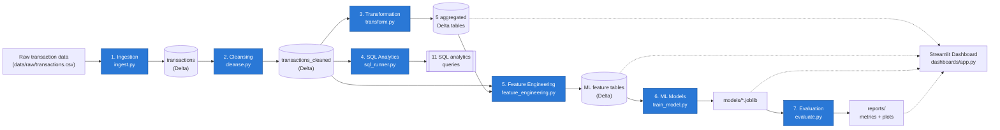

# AI-Powered E-Commerce Analytics Platform


[](https://github.com/Chittalasailu/AI-Powered-Data-Analytics-Platform/actions/workflows/ci.yml)

An end-to-end data engineering and machine learning platform built on
PySpark and Delta Lake: raw e-commerce transaction data flows through
ingestion, cleansing, aggregation, SQL analytics, feature engineering,
model training, and evaluation, then out to an interactive Streamlit
dashboard covering revenue trends, RFM-based customer segmentation, and
churn prediction. The same pipeline runs two ways — a local/CLI
implementation and a native Databricks notebook — driven by one shared
`config.yaml`, so the same logic works unchanged on a laptop or a
scheduled Databricks Job.

This repo is written to be read, not just run: every non-obvious decision
(a broadcast join, a repartition, a temporal train/test split for a churn
model) is explained in-line with *why*, not just *what*, and the trickier
ones are backed by real captured Spark `EXPLAIN` plans rather than
assertions. See [Key Engineering Decisions](#key-engineering-decisions)
for the full story.

## Table of contents

- [Key Features](#key-features)
- [Architecture](#architecture)
- [Tech Stack](#tech-stack)
- [Project Structure](#project-structure)
- [Data Pipeline](#data-pipeline)
- [Machine Learning](#machine-learning)
- [Dashboard](#dashboard)
- [Setup](#setup)
- [Running the Pipeline](#running-the-pipeline)
- [Running the Dashboard](#running-the-dashboard)
- [Running Tests](#running-tests)
- [Sample Results](#sample-results)
- [Key Engineering Decisions](#key-engineering-decisions)
- [CI/CD](#cicd)
- [Databricks](#databricks)
- [Limitations / Honest Notes](#limitations--honest-notes)
- [Future Improvements](#future-improvements)
- [Contributing](#contributing)
- [License](#license)

## Key Features

- **CSV ingestion with explicit schema validation** — [`src/ingestion/ingest.py`](src/ingestion/ingest.py); `PERMISSIVE`-mode parsing captures malformed rows in a `_corrupt_record` column instead of silently dropping or failing the whole job.
- **Data cleansing**: deduplication (exact + conflicting-ID resolution), date-format standardization, type/range enforcement, IQR-based outlier capping, and per-column null imputation (median/mode/sentinel, chosen by column) — [`src/transformation/cleanse.py`](src/transformation/cleanse.py).
- **Delta Lake storage** for every processed table, at every stage.
- **Spark SQL analytics catalog** — 11 named queries covering revenue trends, customer LTV ranking, cohort retention, and regional performance — [`sql/analytics_queries.sql`](sql/analytics_queries.sql).
- **RFM customer analytics** (Recency/Frequency/Monetary) computed in Spark — [`src/transformation/transform.py`](src/transformation/transform.py).
- **Customer segmentation** via KMeans clustering with automatic, silhouette-driven `k` selection.
- **Churn prediction** via a leakage-safe RandomForest classifier (temporal train/label split, not a random split).
- **ML feature engineering**, including a Shannon-entropy category-diversity feature — [`src/ml/feature_engineering.py`](src/ml/feature_engineering.py).
- **Model evaluation**: silhouette score + cluster profiling for segmentation; precision/recall/F1/ROC-AUC + confusion matrix for churn — [`src/ml/evaluate.py`](src/ml/evaluate.py).
- **Interactive Streamlit dashboard** with 4 tabs and sidebar filters — [`dashboards/app.py`](dashboards/app.py).
- **Native Databricks notebook pipeline**, architecturally distinct from the CLI (not a port) — [`notebooks/databricks_pipeline.py`](notebooks/databricks_pipeline.py).
- **Automated test suite** (pytest) with a shared local `SparkSession` fixture — [`tests/`](tests/).
- **GitHub Actions CI** — syntax-checks every entry point and runs the full test suite on every push/PR — [`.github/workflows/ci.yml`](.github/workflows/ci.yml).

## Architecture



**Two ways to run the same seven stages:**

- **`src/pipeline.py`** (local / cron / CI) — runs each stage as its own
  subprocess, in order, with `--stage all|ingest|cleanse|...`, per-stage
  timing, try/except logging, and fail-fast-by-default behavior.
- **`notebooks/databricks_pipeline.py`** (Databricks) — the identical
  seven stages, calling the same `src/` functions directly against the
  cluster's one shared Spark session instead of shelling out to
  subprocesses, with `dbutils.widgets` parameters and native `display()`
  output. See [Databricks](#databricks) below.

`dashboards/app.py` is a separate, independent consumer: it reads the
processed Delta tables and persisted `.joblib` models straight off disk
(via `deltalake`, no Spark/JVM needed) and never re-derives anything the
pipeline already computed.

## Tech Stack

| Layer | Tools |
|---|---|
| Distributed processing | PySpark 4.2, Delta Lake (`delta-spark` 4.4 locally, native on Databricks) |
| SQL analytics | Spark SQL |
| Machine learning | scikit-learn (KMeans, RandomForestClassifier), joblib |
| Dashboard | Streamlit, Plotly, `deltalake` (delta-rs — pure-Python Delta reads, no JVM) |
| Data wrangling | pandas, PyYAML |
| Testing | pytest, a session-scoped local `SparkSession` fixture |
| CI/CD | GitHub Actions |
| Platform | Databricks (Repos, Jobs, notebooks) |

## Project Structure

Generated from the actual repository (`git ls-files`):

```
AI-Powered-Data-Analytics-Platform/
├── config/
│   └── config.yaml                  # single source of truth: paths, formats, model params
├── data/
│   ├── raw/                         # transactions.csv (synthetic, generated — see generate_sample_data.py)
│   └── processed/                   # Delta tables written by every pipeline stage (gitignored, pipeline-generated)
├── src/
│   ├── ingestion/
│   │   └── ingest.py                 # CSV -> Delta, explicit schema, PERMISSIVE-mode validation
│   ├── transformation/
│   │   ├── cleanse.py                # dedup, date standardization, IQR outliers, null imputation
│   │   ├── transform.py              # 5 aggregated analytics tables + Spark optimizations
│   │   └── sql_runner.py             # runs sql/analytics_queries.sql; generates the optimization notes
│   ├── ml/
│   │   ├── feature_engineering.py    # clustering features + leakage-safe churn features
│   │   ├── train_model.py            # KMeans segmentation + RandomForest churn classifier
│   │   └── evaluate.py               # silhouette / precision / recall / F1 / ROC-AUC + confusion matrix
│   ├── utils/                        # shared config loading, Spark session, logging, sample-data generator
│   └── pipeline.py                   # CLI orchestrator: `python src/pipeline.py --stage all`
├── sql/
│   ├── analytics_queries.sql         # 11 named queries: revenue trends, LTV, cohorts, regional
│   └── query_optimization_notes.md   # 3 unoptimized/optimized pairs with real EXPLAIN plans
├── notebooks/
│   └── databricks_pipeline.py        # Databricks-native mirror of the full pipeline
├── dashboards/
│   └── app.py                        # Streamlit dashboard (4 tabs, sidebar filters)
├── models/                           # persisted joblib models (gitignored, pipeline-generated)
├── reports/                          # evaluation metrics + confusion matrix plot (gitignored, generated)
├── tests/                            # pytest suite + shared SparkSession fixture + mock-data factories
├── .github/workflows/ci.yml          # GitHub Actions: syntax-check + pytest on every push/PR
├── pytest.ini
├── requirements.txt
└── CONTRIBUTING.md
```

## Data Pipeline

Each stage is independently runnable (`python src/<stage script> --config config/config.yaml`) and is also wired into `src/pipeline.py`.

| # | Stage | What it does | Why |
|---|---|---|---|
| 1 | **Ingestion** | Reads the raw CSV against an explicit `StructType` schema in `PERMISSIVE` mode, validates it, writes to Delta. | Malformed rows get captured in `_corrupt_record` and counted rather than silently dropped — the boundary between "data someone handed us" and "data we're willing to build a report or model on." |
| 2 | **Cleansing** | Deduplication, date standardization, type/range enforcement, IQR outlier capping, per-column null imputation. | Every step preserves row count except deduplication — outliers and invalid values are treated (capped/nulled), never silently dropped. |
| 3 | **Transformation** | Builds 5 aggregated Delta tables: daily/monthly revenue by region and category, customer RFM, top products, payment-method distribution. | The analytics-ready layer BI tools and the dashboard actually query — see [Key Engineering Decisions](#key-engineering-decisions) for the Spark optimizations here. |
| 4 | **SQL Analytics** | Runs the 11-query catalog in `sql/analytics_queries.sql` against the cleansed data. | Demonstrates the analytics layer as plain Spark SQL, and is the source of the documented query-optimization comparisons. |
| 5 | **Feature Engineering** | Builds two separate feature tables: full-history features for clustering, and leakage-safe (temporal-cutoff) features for churn. | The two downstream models have different requirements for what "safe" features look like — see [Machine Learning](#machine-learning). |
| 6 | **Model Training** | Trains a KMeans segmentation model and a RandomForest churn classifier, each as one `sklearn.Pipeline`, persisted via `joblib`. | One artifact per model with preprocessing bundled in — no separate scaler/encoder to keep in sync at inference time. |
| 7 | **Evaluation** | Computes silhouette score + cluster profile for segmentation; precision/recall/F1/ROC-AUC + confusion matrix for churn. Writes to `reports/`. | The metrics a stakeholder (or a dashboard) actually needs to trust the model — see [Sample Results](#sample-results) for real output. |

## Machine Learning

**Customer segmentation — KMeans** (`src/ml/train_model.py`)
- Features: recency, frequency, monetary, avg order value, distinct categories, category-diversity entropy, distinct payment methods, tenure, customer age.
- `k` is chosen automatically by sweeping k=3–8 and picking the best silhouette score — not a hardcoded guess.
- Evaluated with silhouette score plus a per-cluster feature-mean profile (a silhouette number alone doesn't tell you *who* is in cluster 2).

**Churn prediction — RandomForestClassifier** (`src/ml/train_model.py`, `src/ml/feature_engineering.py`)
- **Temporal train/label split, not a random split**: features are computed only from transactions before a cutoff date; the label (`churned`) comes from activity strictly after it. This deliberately avoids reusing the full-history RFM's `recency_days` as a feature, since that column is measured against the dataset's true final date — exactly what the label is trying to predict.
- `class_weight="balanced"` as a default guard against the "just predict the majority class" failure mode.
- Evaluated on a held-out stratified test split with precision/recall/F1 (per class + macro) and ROC-AUC.

**Be honest about churn performance, as documented in the repo:** the churn classifier's ROC-AUC is **~0.50** — essentially random (see [Sample Results](#sample-results) for the actual numbers). This is not a bug: the synthetic dataset generates each transaction's date independently (`src/utils/generate_sample_data.py`), so there's no genuine persistent per-customer behavioral signal for a temporally-honest model to find. A near-0.5 AUC here is *evidence the leakage-prevention worked* — a leaky pipeline would show suspiciously good performance instead. Full reasoning in [Key Engineering Decisions](#key-engineering-decisions).

## Dashboard

`dashboards/app.py` — a 4-tab Streamlit app reading directly from the processed Delta tables and persisted models:

| Tab | Contents |
|---|---|
| **Revenue Trends** | Line chart (daily/weekly/monthly), one line per region, KPI row, "view as table" expander |
| **Customer Segments** | Cluster-size bar chart, an axis-selectable scatter plot colored/shaped by cluster (predicted live from the persisted KMeans model), optional 2D PCA projection, live-computed cluster profile table |
| **Top Products & Categories** | Toggle between product/category granularity, horizontal bar chart, backing data table |
| **Churn Prediction** | KPI row, probability-distribution histogram split by actual outcome, a threshold-filterable at-risk customer table, confusion matrix from the last evaluation run |

**Sidebar filters** (scope every tab consistently): date range, region, category.

**Screenshots — TODO.** No screenshots currently exist in this repo. Once
you've run `streamlit run dashboards/app.py` locally, capture each tab and
add the files under `docs/screenshots/` — this section will then link to
them with relative paths. No screenshot links are included here until
those files actually exist.

## Setup

### Windows

1. **Create and activate a virtual environment**

   ```powershell
   python -m venv venv
   .\venv\Scripts\Activate.ps1
   ```

2. **Install dependencies**

   ```powershell
   pip install -r requirements.txt
   ```

3. **Spark needs `winutils.exe`.** Even a purely local `local[*]` Spark
   session requires `HADOOP_HOME` to point at a directory containing
   `winutils.exe` on Windows — this isn't specific to this project, it's a
   Spark-on-Windows requirement. Get a build matching your Hadoop version
   (e.g. from `cdarlint/winutils` on GitHub), place it at
   `<HADOOP_HOME>\bin\winutils.exe`, and set:

   ```powershell
   $env:HADOOP_HOME = "C:\hadoop"
   $env:PATH = "C:\hadoop\bin;$env:PATH"
   $env:PYSPARK_PYTHON = "$PWD\venv\Scripts\python.exe"
   $env:PYSPARK_DRIVER_PYTHON = "$PWD\venv\Scripts\python.exe"
   ```

### Linux / macOS

1. **Create and activate a virtual environment**

   ```bash
   python3 -m venv venv
   source venv/bin/activate
   ```

2. **Install dependencies**

   ```bash
   pip install -r requirements.txt
   ```

3. No `winutils.exe`/`HADOOP_HOME` setup needed — that requirement is
   Windows-only. A JVM (Java 17+) still needs to be installed for PySpark.

### Both platforms

4. **Generate the sample dataset** (if `data/raw/transactions.csv` isn't already present):

   ```bash
   python src/utils/generate_sample_data.py --rows 50000 --seed 42
   ```

5. **Check `config/config.yaml`.** `environment: local` (the default)
   reads from and writes to `data/` relative to the repo root. Nothing
   else needs changing to run locally.

For Databricks setup, see the [Databricks](#databricks) section below.

## Running the Pipeline

Run everything, in order (ingest → cleanse → transform → SQL analytics →
feature engineering → train → evaluate):

```bash
python src/pipeline.py --stage all
```

Run one stage, or a subset (always executed in pipeline order regardless
of the order given):

```bash
python src/pipeline.py --stage ingest
python src/pipeline.py --stage cleanse transform
```

Useful flags:

```bash
python src/pipeline.py --stage all --dry-run              # print the plan, run nothing
python src/pipeline.py --stage all --continue-on-failure   # don't stop at the first failed stage
python src/pipeline.py --stage all --env databricks        # forwarded to every stage's own --env
```

Each stage is also independently runnable as its own script (what
`pipeline.py` calls under the hood):

```bash
python src/ingestion/ingest.py --config config/config.yaml
python src/transformation/sql_runner.py --list                                 # list the query catalog
python src/transformation/sql_runner.py --query customer_ltv_ranking           # run one query
python src/transformation/sql_runner.py --compare-optimizations --write-notes  # regenerate sql/query_optimization_notes.md
```

## Running the Dashboard

Requires the pipeline to have populated `data/processed/` and `models/`
first (at minimum: `ingest cleanse transform feature_engineering
train_model`).

```bash
streamlit run dashboards/app.py
```

Opens at `http://localhost:8501`.

## Running Tests

```bash
pytest
```

The same command runs automatically on every push/PR via
[`.github/workflows/ci.yml`](.github/workflows/ci.yml) — see [CI/CD](#cicd).

Config lives in `pytest.ini`; `tests/conftest.py` provides a single
session-scoped local `SparkSession` fixture shared by every test.
`tests/factories.py` has small helpers for building schema-correct mock
DataFrames without repeating all 12 transaction columns in every test.

| File | Covers |
|---|---|
| `tests/test_ingestion.py` | Schema validation — exact match, missing column, type mismatch, tolerated extra columns |
| `tests/test_cleansing.py` | Deduplication (exact + conflicting-ID), IQR outlier capping, valid-range enforcement, null imputation, and the full `DataCleanser` pipeline |
| `tests/test_transformation.py` | `compute_daily_revenue`, `compute_customer_rfm`, `compute_top_products_by_category` |
| `tests/test_feature_engineering.py` | Output shape/columns and row-level correctness for both `build_clustering_features` and `build_churn_features`, including the churn label's temporal-cutoff logic |

Windows: the same `HADOOP_HOME`/`winutils.exe` setup from [Setup](#setup)
is required to run the suite — see also the Windows note in
[Limitations](#limitations--honest-notes).

## Sample Results

Real output from an actual full pipeline run against the 50K-row
synthetic sample dataset (`python src/pipeline.py --stage all`) —
regenerate these yourself; nothing below is hardcoded in the repo.

**Pipeline run — all 7 stages, real timing:**

```
[  OK   ] ingest                    78.53s
[  OK   ] cleanse                  195.76s
[  OK   ] transform                105.59s
[  OK   ] sql_analytics             80.28s
[  OK   ] feature_engineering      145.95s
[  OK   ] train_model              201.19s
[  OK   ] evaluate                 128.66s
Total elapsed: 935.98s
```

**`reports/segmentation_metrics.json`:**

```json
{
  "silhouette_score": 0.1884,
  "n_clusters": 3,
  "n_customers": 5996,
  "cluster_sizes": { "0": 2258, "1": 2729, "2": 1009 }
}
```

**`reports/churn_metrics.json`** (see [Machine
Learning](#machine-learning) for why this AUC is deliberately,
informatively close to 0.5):

```json
{
  "accuracy": 0.5063,
  "roc_auc": 0.5038,
  "churned": { "precision": 0.4706, "recall": 0.4421, "f1": 0.4559 }
}
```

Dashboard screenshots: see the TODO note in [Dashboard](#dashboard) —
none exist in the repo yet.

## Key Engineering Decisions

The short version, organized by layer. Each of these is documented more
fully — with real captured evidence, not just claims — in the file noted.

### Spark performance (`src/transformation/transform.py`)

- **Broadcast joins**, not sort-merge, for every small-table join: a
  5-row region dimension joined onto the full fact table, and
  per-category / grand-total aggregates joined back for percentage
  calculations. Verified which physical join operator Spark actually
  chose via `EXPLAIN FORMATTED` rather than assuming the hint worked (see
  `sql/query_optimization_notes.md`).
- **`repartition(n, "customer_id")`** on the base dataset specifically so
  the RFM `groupBy("customer_id")` can skip its shuffle entirely —
  Spark's planner elides a redundant `Exchange` when the child's
  partitioning already matches what the aggregation requires.
- **Caching with a stated reason, not by default**: the base dataset is
  cached because 5 independent output tables each scan it; the
  per-customer RFM aggregate is cached separately because it's read by 3
  `approxQuantile` calls plus the final scoring pass.
- **Avoided wide transformations where a narrow one suffices**: RFM's
  recency/frequency/monetary computed in one `groupBy().agg()` instead of
  three separate groupBys joined back together; quartile scoring via
  `approxQuantile` + `when/otherwise` instead of `ntile()` over an
  unpartitioned `Window` (which would collapse the entire dataset onto
  one partition just to compute a global rank).
- **`coalesce()`, not `repartition()`, before every write** — reducing
  output file count doesn't need a full shuffle. **`partitionBy()`** on
  region/category for the tables BI queries are expected to filter on.
- **`spark.sql.shuffle.partitions`** tuned down from Spark's
  cluster-sized default of 200 to match this dataset's actual size, so
  every shuffle doesn't spawn 200 mostly-empty tasks.

### SQL query optimization, verified with real `EXPLAIN` plans (`sql/query_optimization_notes.md`)

Three unoptimized/optimized pairs, each run for real and compared by
actual captured physical plan, not by reasoning about what Spark's
optimizer *should* do:

1. **Forced sort-merge vs. forced broadcast join** on the region
   dimension — confirms the operator actually changes (`SortMergeJoin` →
   `BroadcastHashJoin`), and surfaces a genuinely useful finding: with
   *no* hint at all, Spark's optimizer broadcasts the wrong side (the
   fact table, not the dimension) here, because the dimension table lacks
   the file-based size statistics the parquet-backed fact table has — a
   real argument for explicit hints over trusting auto-detection.
2. **Self-join anti-pattern vs. a window function** for customer LTV
   ranking — an inequality self-join to emulate `RANK()` forces a
   `BroadcastNestedLoopJoin` (~n² comparisons); `RANK() OVER (...)`
   computes the identical ranking with one sort pass and no join at all.
3. **A missing pre-filter before a self-join** in cohort retention — this
   one is a correctness bug as much as a performance one: without
   excluding the `UNKNOWN_CUSTOMER` sentinel before the join, one
   cohort's reported count differs by exactly one row (1406 vs. 1405) —
   the sentinel collapsing every unrelated "missing customer" transaction
   into one fake mega-customer. Caught by comparing actual output values,
   not just row counts, between the two versions.

### ML: leakage-safe by construction, verified rather than assumed

Full detail in [Machine Learning](#machine-learning) above — summarized:
temporal (not random) train/label split for churn; a churn AUC of ~0.50
treated as *evidence against* leakage rather than a failure to hide;
silhouette-driven `k` selection for KMeans; `class_weight="balanced"`;
one `sklearn.Pipeline` per model persisted as a single `joblib` artifact;
category diversity via Shannon entropy rather than a raw distinct count.

### Orchestration (`src/pipeline.py`, `notebooks/databricks_pipeline.py`)

- **Subprocess-per-stage**, not in-process function calls, for the CLI
  orchestrator: each stage builds and tears down its own `SparkSession`,
  so running each as its own OS process means one stage's failure mode
  can't leak into another's, and a subprocess's exit code is an
  unambiguous success signal no in-process exception-swallowing could
  quietly hide.
- **The Databricks notebook is not a port of the CLI** — see
  [Databricks](#databricks).

### Dashboard (`dashboards/app.py`)

- **Reads Delta tables via `deltalake` (delta-rs), not Spark** — a pure
  Python read of the transaction log, correct regardless of how many
  stale files an earlier overwrite left on disk (which a naive
  Parquet-directory glob would risk reading), with no JVM needed in the
  serving layer at all.
- **Colors follow the entity, not the filter**: each region keeps the
  same color whether the sidebar filter shows all five or just one; the
  retained/churned split uses reserved status colors (green/red), not a
  generic categorical palette slot, since it's a good/bad outcome, not
  "series 4."

### Everything here was actually run, not just written

Every module in this repo was executed against real data at least once
during development, and several real bugs were caught and fixed exactly
that way rather than by code review alone — a `pandas`
`groupby().resample()` `IndexError` against a filtered (non-contiguous
index) DataFrame in the dashboard, and a `logging` reserved-attribute
collision (`extra={"name": ...}` silently colliding with `LogRecord.name`)
in the SQL runner. The instinct to verify rather than assume applies to
this repo's own tooling, not just the data pipeline it builds.

## CI/CD

[`.github/workflows/ci.yml`](.github/workflows/ci.yml) runs on every
push/PR against `main`:

1. Checks out the repo, sets up Java 17 (Temurin) and Python 3.12.
2. `pip install -r requirements.txt`.
3. `python -m py_compile` on every entry point — `src/pipeline.py`, each
   pipeline/ML module, `dashboards/app.py`, and the Databricks notebook —
   so a change that doesn't even import cleanly fails immediately.
4. `pytest -v` — the full test suite.

Runs on a plain Ubuntu GitHub-hosted runner, which needs none of the
Windows-only `HADOOP_HOME`/`winutils.exe` setup from
[Setup](#setup) — CI is the most reliable place to confirm a change
works, independent of any one contributor's OS.

## Databricks

**Architecture.** `notebooks/databricks_pipeline.py` is a deliberately
different implementation from the CLI, not a port of it — a Databricks
notebook attaches to one cluster and gets one shared `spark`/`dbutils`
object for its whole run, so the notebook:

- Never calls `build_spark_session()` — `spark` already exists.
- Never calls `get_dbutils()` — `dbutils` already exists.
- Calls the same `src/` functions (`DataCleanser(df, config).run()`,
  `compute_customer_rfm(df)`, `train_segmentation_model(...)`, etc.)
  directly, instead of shelling out to each stage's `main()`.
- Reads every stage's input from Delta rather than a Python variable left
  by an earlier cell, so any single cell can be re-run independently.
- Uses `dbutils.widgets` (repo root, churn window, KMeans k range,
  RandomForest `n_estimators`, model/report output paths) instead of
  `argparse`, mapped onto the same config-driven `Settings` dataclasses
  the CLI uses.

**Setup:**

1. Check this repo into Databricks Repos (or Git folders).
2. Set `environment: databricks` in `config/config.yaml` (the notebook
   also hardcodes `ENVIRONMENT = "databricks"` itself, since a notebook
   only ever runs attached to a cluster). `paths.databricks` in
   `config.yaml` points at `/mnt/datalake/raw` /
   `/mnt/datalake/processed` — adjust to your workspace's actual mount or
   Unity Catalog Volume paths.
3. Open `notebooks/databricks_pipeline.py`, set the `repo_root` widget to
   this checkout's path, and run all cells.
4. **Scheduling**: the notebook's own final section, "Scheduling this as
   a Databricks Job," documents exactly where to configure the Job task,
   cluster (Job cluster vs. all-purpose, runtime, node sizing), schedule
   trigger, retries/alerting, and when to graduate to a multi-task Job.

## Limitations / Honest Notes

- **Synthetic dataset.** `data/raw/transactions.csv` is generated by
  `src/utils/generate_sample_data.py`, not real transaction data. Each
  row's fields (including purchase date) are generated independently per
  transaction, which is directly why the churn model finds no real
  signal — see [Machine Learning](#machine-learning).
- **Churn model performance is near-random (ROC-AUC ≈ 0.50)** on this
  dataset, by design of the dataset, not a flaw in the leakage-prevention
  approach — documented rather than hidden, with the reasoning in
  [Machine Learning](#machine-learning).
- **Windows PySpark requires `winutils.exe`/`HADOOP_HOME`.** This is a
  Spark-on-Windows requirement, not specific to this project, but it's
  the single most common local setup failure — see [Setup](#setup).
- **Intermittent Windows `py4j`/JVM-worker socket instability** has been
  observed locally during test-suite runs (`Python worker exited
  unexpectedly`) — reproducible even outside pytest, in a bare script,
  and unrelated to any logic in this repo (the same code runs correctly
  against the full 50K-row dataset in a full pipeline run). If a local
  test run stalls, it's this, not a deadlock in the test code; killing
  and re-running usually clears it. GitHub Actions CI runs on Ubuntu and
  does not hit this.
- **No screenshots yet** — see [Dashboard](#dashboard).
- **No LICENSE file yet** — see [License](#license).
- **No authentication on the dashboard.** `streamlit run dashboards/app.py`
  is unauthenticated by default; fine for local/portfolio use, not for a
  multi-user deployment as-is.

## Future Improvements

Realistic next steps, clearly **not implemented** — a roadmap, not a
features list:

- Replace the synthetic dataset with a real (or more realistically
  correlated) transaction source, so the churn model has genuine
  customer-level behavioral signal to learn from.
- Cloud object storage (S3 / ADLS / GCS) instead of local disk / a single
  DBFS mount for the processed data layer.
- Orchestrate as a proper multi-task Databricks Job (or Airflow/Dagster)
  instead of one linear notebook/script, for per-stage retries and
  monitoring — the notebook's own "Scheduling" section already outlines
  this path.
- Model monitoring / drift detection for the segmentation and churn
  models once running on a real, changing dataset.
- Scale-testing against a dataset large enough that the Spark
  optimizations in this repo matter for wall-clock time, not just as a
  demonstrated technique on a 50K-row sample.
- Authentication/access control for a shared (non-local) dashboard
  deployment.
- A real deployment target for the dashboard (e.g. Streamlit Community
  Cloud or a Databricks App) beyond `streamlit run` locally.

## Contributing

See [`CONTRIBUTING.md`](CONTRIBUTING.md) for this codebase's conventions
(config-driven settings, structured JSON logging, pure-function
transformations, the "verify with `EXPLAIN`, don't assume" habit this
project follows throughout), plus the checklist to run before opening a
PR and the steps for adding a new pipeline stage.

## License

No license file has been added to this repository yet — until one is
added, standard copyright applies and no reuse rights are implied. If
you'd like this project to be usable by others under an open-source
license (e.g. MIT), add a `LICENSE` file (GitHub's repository settings
has a license picker that does this in a few clicks).
