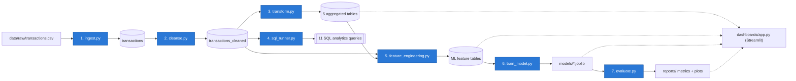
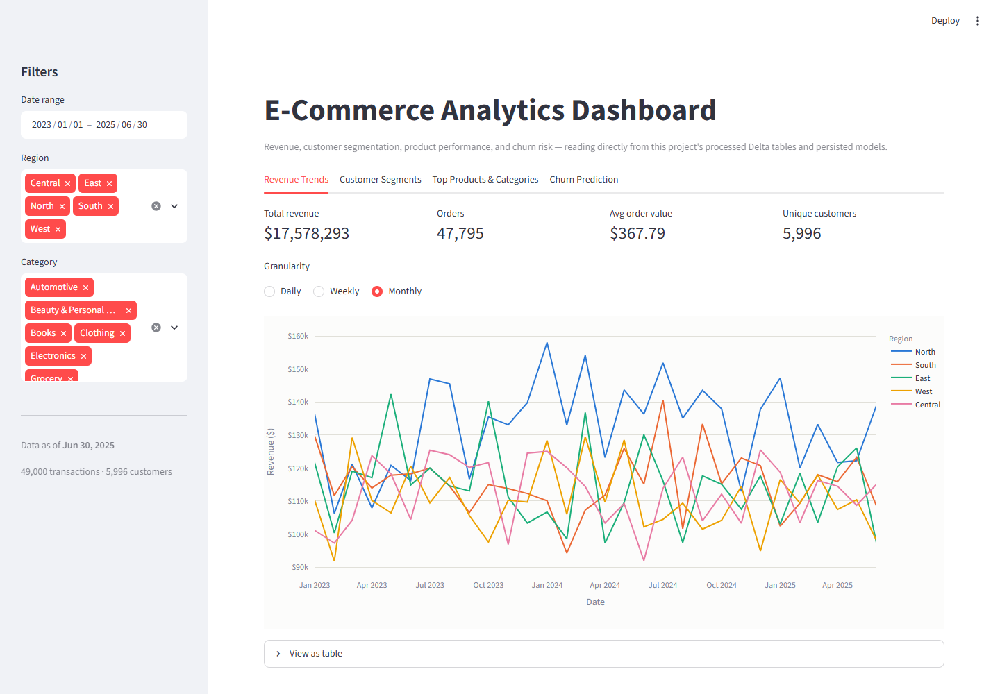
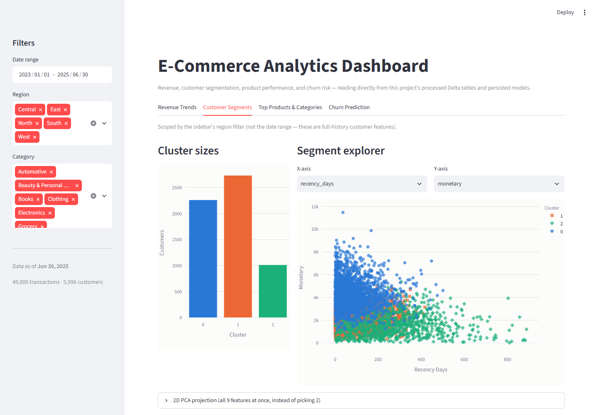
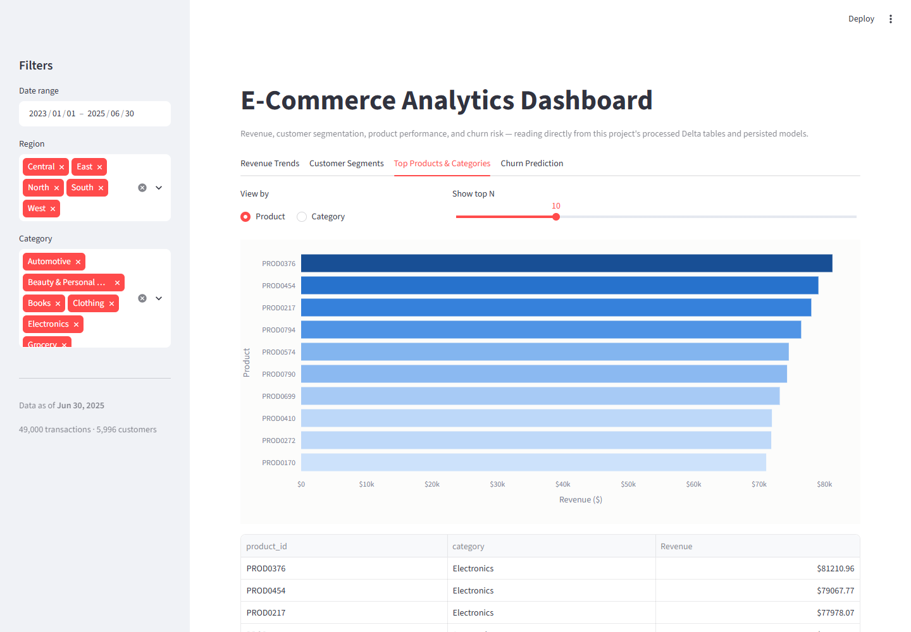
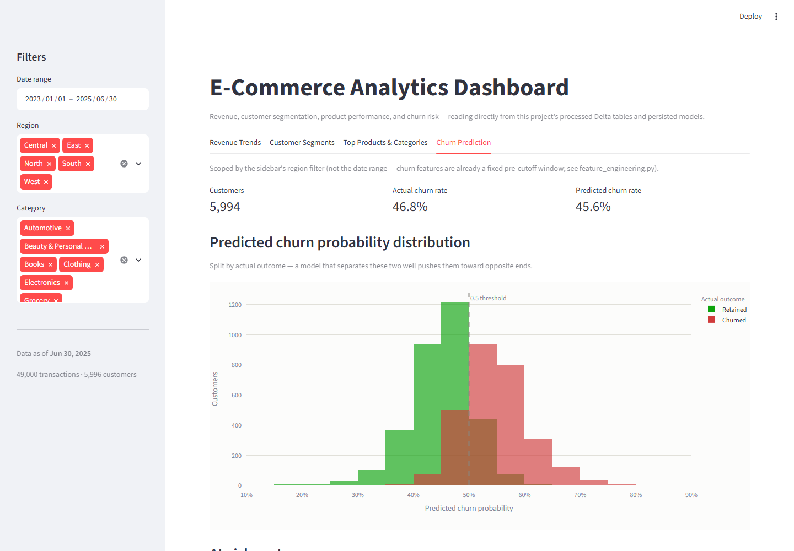

# AI-Powered E-Commerce Analytics Platform

[](https://github.com/<your-github-username>/ai-data-analytics-platform/actions/workflows/ci.yml)

> Replace `<your-github-username>` above once this is pushed — see
> [Setup](#setup) for the exact `gh` commands.

An end-to-end data engineering + machine learning platform built on PySpark
and Delta Lake: raw e-commerce transaction data flows through ingestion,
cleansing, aggregation, SQL analytics, feature engineering, model training,
and evaluation, then out to an interactive Streamlit dashboard. The same
pipeline ships two ways — a local/CLI implementation and a Databricks
notebook — driven by one shared `config.yaml`.

This repo is written to be read, not just run: every non-obvious decision
(a broadcast join, a repartition, a temporal train/test split for a churn
model) is explained in-line with *why*, not just *what*, and the trickier
ones are backed by real captured Spark `EXPLAIN` plans rather than
assertions. See [Key Engineering Decisions](#key-engineering-decisions) for
the resume/interview-ready version of that story.

## Table of contents

- [Architecture](#architecture)
- [Tech stack](#tech-stack)
- [Project structure](#project-structure)
- [Setup](#setup)
  - [Local](#local-setup)
  - [Databricks](#databricks-setup)
- [Running the pipeline](#running-the-pipeline)
- [Running the dashboard](#running-the-dashboard)
- [Running the tests](#running-the-tests)
- [Sample outputs](#sample-outputs)
- [Key Engineering Decisions](#key-engineering-decisions)

## Architecture



Two orchestrators drive the same seven stages:

- **`src/pipeline.py`** (local / cron / CI) — runs each stage as its own
  subprocess, in order, with `--stage all|ingest|cleanse|...`, per-stage
  timing, try/except logging, and fail-fast-by-default behavior.
- **`notebooks/databricks_pipeline.py`** (Databricks) — the identical seven
  stages, calling the same `src/` functions directly against the cluster's
  one shared Spark session instead of shelling out to subprocesses, with
  `dbutils.widgets` parameters and `display()` output for a portfolio
  walkthrough. See that file's own final section for exactly where to
  configure a Databricks Job/cluster to schedule it.

`dashboards/app.py` is a separate, independent consumer: it reads the
processed Delta tables and persisted `.joblib` models straight off disk (via
`deltalake`, no Spark/JVM needed) and never re-derives anything the pipeline
already computed.

## Tech stack

| Layer | Tools |
|---|---|
| Distributed processing | PySpark, Delta Lake (`delta-spark` locally, native on Databricks) |
| SQL analytics | Spark SQL |
| ML | scikit-learn (KMeans, RandomForestClassifier), joblib |
| Dashboard | Streamlit, Plotly, `deltalake` (delta-rs, pure-Python Delta reads) |
| Data wrangling | pandas, PyYAML |
| Testing | pytest, a session-scoped local `SparkSession` fixture |
| Platform | Databricks (Repos, Jobs, notebooks) |

## Project structure

```
ai-data-analytics-platform/
├── config/
│   └── config.yaml              # single source of truth: paths, formats, model params
├── data/
│   ├── raw/                     # transactions.csv (synthetic, see src/utils/generate_sample_data.py)
│   └── processed/                # Delta tables written by every pipeline stage
├── src/
│   ├── ingestion/
│   │   └── ingest.py             # CSV -> Delta, explicit schema, PERMISSIVE-mode validation
│   ├── transformation/
│   │   ├── cleanse.py            # dedup, date standardization, IQR outliers, null imputation
│   │   ├── transform.py          # 5 aggregated analytics tables + Spark optimizations
│   │   └── sql_runner.py         # runs sql/analytics_queries.sql; generates the optimization notes
│   ├── ml/
│   │   ├── feature_engineering.py  # clustering features + leakage-safe churn features
│   │   ├── train_model.py          # KMeans segmentation + RandomForest churn classifier
│   │   └── evaluate.py             # silhouette / precision / recall / F1 / ROC-AUC + confusion matrix
│   ├── utils/                    # shared config loading, Spark session, logging
│   └── pipeline.py               # CLI orchestrator: `python src/pipeline.py --stage all`
├── sql/
│   ├── analytics_queries.sql        # 11 named queries: revenue trends, LTV, cohorts, regional
│   └── query_optimization_notes.md  # 3 unoptimized/optimized pairs with real EXPLAIN plans
├── notebooks/
│   └── databricks_pipeline.py    # Databricks-native mirror of the full pipeline
├── dashboards/
│   └── app.py                    # Streamlit dashboard (4 tabs, sidebar filters)
├── models/                       # persisted joblib models (gitignored, pipeline-generated)
├── reports/                      # evaluation metrics + confusion matrix plot (gitignored, generated)
├── tests/                        # pytest suite + shared SparkSession fixture
├── pytest.ini
└── requirements.txt
```

## Setup

### Local setup

1. **Create and activate a virtual environment**

   ```powershell
   python -m venv venv
   .\venv\Scripts\Activate.ps1
   ```

2. **Install dependencies**

   ```bash
   pip install -r requirements.txt
   ```

3. **Windows only: Spark needs `winutils.exe`.** Even a purely local
   `local[*]` Spark session requires `HADOOP_HOME` to point at a directory
   containing `winutils.exe` on Windows — this isn't specific to this
   project, it's a Spark-on-Windows requirement. Get a build matching your
   Hadoop version (e.g. from `cdarlint/winutils` on GitHub), place it at
   `<HADOOP_HOME>\bin\winutils.exe`, and set:

   ```powershell
   $env:HADOOP_HOME = "C:\hadoop"
   $env:PATH = "C:\hadoop\bin;$env:PATH"
   $env:PYSPARK_PYTHON = "$PWD\venv\Scripts\python.exe"
   $env:PYSPARK_DRIVER_PYTHON = "$PWD\venv\Scripts\python.exe"
   ```

   (macOS/Linux users can skip this step entirely.)

4. **Generate the sample dataset** (if `data/raw/transactions.csv` isn't
   already present):

   ```bash
   python src/utils/generate_sample_data.py --rows 50000 --seed 42
   ```

5. **Check `config/config.yaml`.** `environment: local` (the default) reads
   from and writes to `data/` relative to the repo root. Nothing else needs
   changing to run locally.

### Databricks setup

1. **Check the repo into Databricks Repos** (or Git folders), so
   `notebooks/databricks_pipeline.py` and the `src/` package it imports live
   together on the cluster's filesystem.
2. **Set `environment: databricks`** in `config/config.yaml` (or leave it
   `local` and let the notebook's hardcoded `ENVIRONMENT = "databricks"`
   override it — see the notebook's own comments). `paths.databricks` in
   `config.yaml` already points at `/mnt/datalake/raw` /
   `/mnt/datalake/processed`; adjust to your workspace's actual mount or
   Unity Catalog Volume paths.
3. **Open `notebooks/databricks_pipeline.py`**, set the `repo_root` widget
   to this checkout's path, and run all cells. It needs no
   `build_spark_session()` call and no `%pip install` on the ML runtime —
   see the notebook's own architecture notes at the top for exactly what's
   different from the local pipeline and why.
4. **To schedule it**, see the notebook's final markdown section,
   "Scheduling this as a Databricks Job" — it covers Job/cluster
   configuration, `dbutils.widgets` as Job parameters, scheduling triggers,
   retries/alerting, and when to graduate to a multi-task Job.

## Running the pipeline

Run everything, in order (ingest → cleanse → transform → SQL analytics →
feature engineering → train → evaluate):

```bash
python src/pipeline.py --stage all
```

Run one stage, or a subset (always executed in pipeline order regardless of
the order given):

```bash
python src/pipeline.py --stage ingest
python src/pipeline.py --stage cleanse transform
```

Useful flags:

```bash
python src/pipeline.py --stage all --dry-run              # print the plan, run nothing
python src/pipeline.py --stage all --continue-on-failure   # don't stop at the first failed stage
python src/pipeline.py --stage all --env databricks        # forwarded to every stage's own --env
```

Each stage is also independently runnable as its own script (what
`pipeline.py` calls under the hood), e.g.:

```bash
python src/ingestion/ingest.py --config config/config.yaml
python src/transformation/sql_runner.py --list                          # list the query catalog
python src/transformation/sql_runner.py --query customer_ltv_ranking    # run one query
python src/transformation/sql_runner.py --compare-optimizations --write-notes  # regenerate sql/query_optimization_notes.md
```

## Running the dashboard

Requires the pipeline to have populated `data/processed/` and `models/`
first (at minimum: `ingest cleanse transform feature_engineering
train_model`).

```bash
streamlit run dashboards/app.py
```

Opens at `http://localhost:8501` with four tabs (Revenue Trends, Customer
Segments, Top Products & Categories, Churn Prediction) and sidebar filters
(date range, region, category) that scope every tab consistently.

## Running the tests

```bash
pytest
```

The same command runs automatically on every push/PR via
[`.github/workflows/ci.yml`](.github/workflows/ci.yml) — GitHub Actions, on
a plain Ubuntu runner, syntax-checks every entry point (including
`dashboards/app.py` and the Databricks notebook) and runs the full pytest
suite. Ubuntu runners need none of the Windows-only `HADOOP_HOME`/
`winutils.exe` setup below, so CI is actually the most reliable place to
confirm a change works.

Config lives in `pytest.ini`; `tests/conftest.py` provides a single
session-scoped local `SparkSession` fixture shared by every test (starting a
SparkSession costs real wall-clock time, so it's built once, not per test).
`tests/factories.py` has small helpers for building schema-correct mock
DataFrames without repeating all 12 transaction columns in every test.

Coverage:

| File | Covers |
|---|---|
| `tests/test_ingestion.py` | Schema validation — exact match, missing column, type mismatch, tolerated extra columns |
| `tests/test_cleansing.py` | Deduplication (exact + conflicting-id), IQR outlier capping, valid-range enforcement, null imputation, and the full `DataCleanser` pipeline |
| `tests/test_transformation.py` | `compute_daily_revenue`, `compute_customer_rfm`, `compute_top_products_by_category` |
| `tests/test_feature_engineering.py` | Output shape/columns and row-level correctness for both `build_clustering_features` and `build_churn_features` (including the churn label's temporal-cutoff logic) |

(Windows: the same `HADOOP_HOME`/`winutils.exe` setup from
[Local setup](#local-setup) is required to run the suite.)

## Sample outputs

Real numbers from a full pipeline run against the 50K-row sample dataset —
regenerate these by running the pipeline and dashboard yourself; the numbers
below aren't hardcoded anywhere, they're just what this run happened to
produce.

**`reports/segmentation_metrics.json`:**

```json
{
  "silhouette_score": 0.1884,
  "n_clusters": 3,
  "n_customers": 5996,
  "cluster_sizes": { "0": 2258, "1": 2729, "2": 1009 }
}
```

**`reports/churn_metrics.json`** (see [Key Engineering
Decisions](#a-model-that-honestly-reports-it-found-no-signal) for why this
model's AUC is deliberately, informatively close to 0.5):

```json
{
  "accuracy": 0.5063,
  "roc_auc": 0.5038,
  "churned": { "precision": 0.4706, "recall": 0.4421, "f1": 0.4559 }
}
```

**Dashboard screenshots** — replace with real captures after running
`streamlit run dashboards/app.py` locally:

| Tab | Screenshot |
|---|---|
| Revenue Trends | `docs/screenshots/revenue-trends.png` |
| Customer Segments | `docs/screenshots/customer-segments.png` |
| Top Products & Categories | `docs/screenshots/top-products.png` |
| Churn Prediction | `docs/screenshots/churn-prediction.png` |

```markdown




```

## Key Engineering Decisions

The short version, organized by layer. Each of these is documented more
fully — with real captured evidence, not just claims — in the file noted.

### Spark performance (`src/transformation/transform.py`)

- **Broadcast joins**, not sort-merge, for every small-table join: a 5-row
  region dimension joined onto the full fact table, and per-category /
  grand-total aggregates joined back for percentage calculations. Verified
  which physical join operator Spark actually chose via `EXPLAIN
  FORMATTED` rather than assuming the hint worked (see
  `sql/query_optimization_notes.md`).
- **`repartition(n, "customer_id")`** on the base dataset specifically so
  the RFM `groupBy("customer_id")` can skip its shuffle entirely — Spark's
  planner elides a redundant `Exchange` when the child's partitioning
  already matches what the aggregation requires.
- **Caching with a stated reason, not by default**: the base dataset is
  cached because 5 independent output tables each scan it; the per-customer
  RFM aggregate is cached separately because it's read by 3 `approxQuantile`
  calls plus the final scoring pass.
- **Avoided wide transformations where a narrow one suffices**: RFM's
  recency/frequency/monetary computed in one `groupBy().agg()` instead of
  three separate groupBys joined back together; quartile scoring via
  `approxQuantile` + `when/otherwise` instead of `ntile()` over an
  unpartitioned `Window` (which would collapse the entire dataset onto one
  partition just to compute a global rank).
- **`coalesce()`, not `repartition()`, before every write** — reducing
  output file count doesn't need a full shuffle. **`partitionBy()`** on
  region/category for the tables BI queries are expected to filter on.
- **`spark.sql.shuffle.partitions`** tuned down from Spark's
  cluster-sized default of 200 to match this dataset's actual size, so
  every shuffle doesn't spawn 200 mostly-empty tasks.

### SQL query optimization, verified with real `EXPLAIN` plans (`sql/query_optimization_notes.md`)

Three unoptimized/optimized pairs, each run for real and compared by actual
captured physical plan, not by reasoning about what Spark's optimizer
*should* do:

1. **Forced sort-merge vs. forced broadcast join** on the region dimension —
   confirms the operator actually changes (`SortMergeJoin` →
   `BroadcastHashJoin`), and surfaces a genuinely useful finding: with *no*
   hint at all, Spark's optimizer broadcasts the wrong side (the fact
   table, not the dimension) here, because the dimension table lacks the
   file-based size statistics the parquet-backed fact table has — a real
   argument for explicit hints over trusting auto-detection.
2. **Self-join anti-pattern vs. a window function** for customer LTV
   ranking — an inequality self-join to emulate `RANK()` forces a
   `BroadcastNestedLoopJoin` (~n² comparisons); `RANK() OVER (...)` computes
   the identical ranking with one sort pass and no join at all.
3. **A missing pre-filter before a self-join** in cohort retention — this
   one is a correctness bug as much as a performance one: without excluding
   the `UNKNOWN_CUSTOMER` sentinel before the join, one cohort's reported
   count differs by exactly one row (1406 vs. 1405) — the sentinel
   collapsing every unrelated "missing customer" transaction into one fake
   mega-customer. Caught by comparing actual output values, not just row
   counts, between the two versions.

### ML: leakage-safe by construction, verified rather than assumed (`src/ml/feature_engineering.py`, `train_model.py`)

- **Temporal train/label split for churn**, not a random split: features
  are computed only from transactions before a cutoff date; the label
  (`churned`) comes from activity strictly after it. Deliberately does
  *not* reuse the full-history RFM's `recency_days` as a churn feature,
  since that column is measured against the dataset's true final date —
  exactly what the label is trying to predict.
- <a id="a-model-that-honestly-reports-it-found-no-signal"></a>**A model
  that honestly reports it found no signal.** The churn classifier's ROC-AUC
  lands at ~0.50 — essentially random. That's not a bug: this dataset's
  purchase dates are generated independently per transaction (see
  `src/utils/generate_sample_data.py`), so there's no genuine persistent
  per-customer behavioral signal for a temporally-honest model to find. A
  near-0.5 AUC here is reassuring evidence of *no leakage* — a leaky
  pipeline would show suspiciously good performance instead. Same
  architecture, run against a real dataset with genuine customer-level
  behavioral persistence, would be expected to show real lift.
- **Silhouette-driven `k` selection** for the KMeans segmentation model
  (sweeps k=3-8, picks the best by silhouette score, not a hardcoded
  guess), and **`class_weight="balanced"`** for the churn classifier as a
  default guard against the "just predict the majority class" failure mode.
- **One `sklearn.Pipeline` per model** (preprocessing + estimator bundled
  together), persisted as a single `joblib` artifact — no separate
  scaler/encoder to keep in sync with the model at inference time.
- **Category-diversity feature via Shannon entropy**, not just a distinct
  count — distinguishes "buys a little of everything" from "buys almost
  everything from one category, dabbles elsewhere," which a raw count of
  categories can't.

### Orchestration (`src/pipeline.py`, `notebooks/databricks_pipeline.py`)

- **Subprocess-per-stage**, not in-process function calls, for the CLI
  orchestrator: each stage builds and tears down its own `SparkSession`, so
  running each as its own OS process means one stage's failure mode can't
  leak into another's, and a subprocess's exit code is an unambiguous
  success signal no in-process exception-swallowing could quietly hide.
- **The Databricks notebook is not a port of the CLI** — it's a
  deliberately different architecture for a genuinely different execution
  model: one shared cluster session instead of seven independent ones,
  `dbutils.widgets` instead of `argparse`, direct function calls into the
  same `src/` modules instead of shelling out. Both read the same
  `config.yaml`.

### Dashboard (`dashboards/app.py`)

- **Reads Delta tables via `deltalake` (delta-rs), not Spark** — a pure
  Python read of the transaction log, correct regardless of how many stale
  files an earlier overwrite left on disk (which a naive Parquet-directory
  glob would risk reading), with no JVM needed in the serving layer at all.
- **Colors follow the entity, not the filter**: each region keeps the same
  color whether the sidebar filter shows all five or just one; the
  retained/churned split uses reserved status colors (green/red), not a
  generic categorical palette slot, since it's a good/bad outcome, not
  "series 4."

### Version control wired to the dashboard, not just alongside it

The dashboard isn't merely a file that happens to sit in the same repo as
everything else — `.github/workflows/ci.yml` runs on every push/PR and
syntax-checks `dashboards/app.py` specifically (alongside every other entry
point) before running the test suite, so a change to the dashboard that
doesn't even import cleanly fails CI immediately rather than being
discovered the next time someone runs `streamlit run`.

### Everything here was actually run, not just written

Every module in this repo was executed against real data at least once
during development, and several real bugs were caught and fixed exactly
that way rather than by code review alone — a `pandas`
`groupby().resample()` `IndexError` against a filtered (non-contiguous
index) DataFrame in the dashboard, and a `logging` reserved-attribute
collision (`extra={"name": ...}` silently colliding with `LogRecord.name`)
in the SQL runner. The instinct to verify rather than assume applies to
this repo's own tooling, not just the data pipeline it builds.

> **Windows note:** this environment's local PySpark setup occasionally hits
> an intermittent `py4j`/JVM-worker socket instability (`Python worker
> exited unexpectedly`) under Windows — reproducible even outside pytest, in
> a bare script, and unrelated to any logic in this repo (the same
> `deduplicate()` code runs correctly against the full 50K-row production
> dataset). If a test run stalls, it's this, not a deadlock in the test
> code; killing and re-running usually clears it. Filed here rather than
> silently worked around, since a README claiming untroubled test runs
> should say so honestly if that's not quite true yet on every platform.
